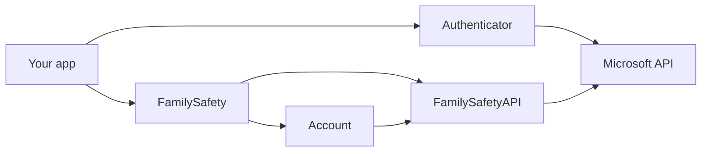
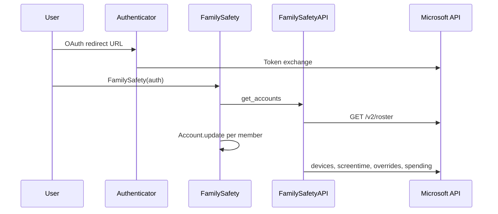

# Architecture

**pyfamilysafety** mirrors the Microsoft Family Safety Android app's use of the
mobile aggregator API at `mobileaggregator.family.microsoft.com`.

## Component overview

## Request flow

## Layer responsibilities

| Component | Role |
| --- | --- |
| `Authenticator` | OAuth code/refresh token exchange with `login.live.com` |
| `FamilySafetyAPI` | HTTP transport, auth headers, token refresh, endpoint routing |
| `FamilySafety` | Roster cache, pending requests, coordinates account updates |
| `Account` | Per-member state: devices, apps, usage, limits, web filtering |
| `Device`, `Application` | Parsed domain models |
| `schedule` | Payload builders for device limit PATCH requests |

## Concurrency

- `FamilySafety.update()` uses `asyncio.gather` to refresh all accounts in parallel.
- `Account.update()` parallelizes device list, screen time, overrides, and spending.
- `Authenticator` uses an `asyncio.Lock` to serialize login and refresh operations.

## User-Agent

Requests identify as the Family Safety Android app via `USER_AGENT` in
`pyfamilysafety.const`. This matches what the official client sends.

## Further reading

- [Endpoint map](endpoints.md)
- [Error handling](error-handling.md)
- [Timezones](timezones.md)
